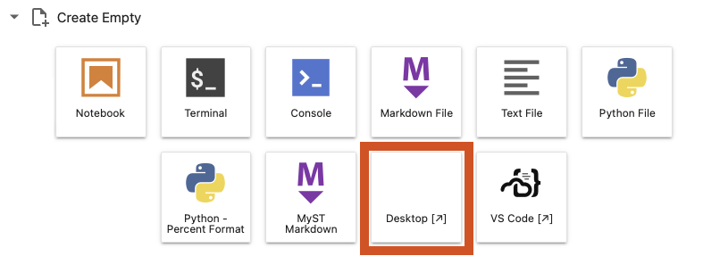
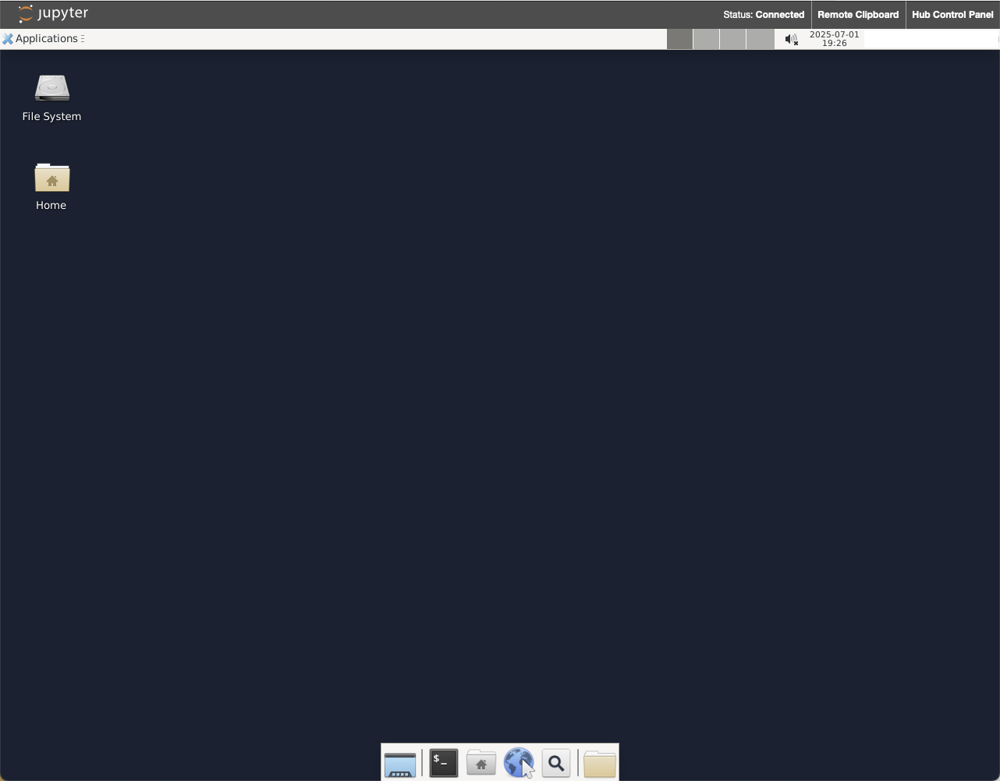
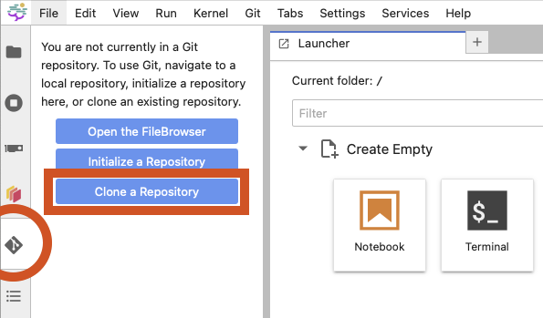

# Alternative: Open the notebooks and run napari in the cloud using SciPy 2025 Nebari instance

If you can't install napari and the Jupyter notebook application locally, or if you prefer using a cloud instance of Jupyter to execute and interact with the workshop notebooks, you can follow this guide.

To get started, log into the SciPy 2025 Nebari instance following the instructions provided to you by the SciPy 2025 organizers by email.

```{tip}
If the conference has already ended, but you still want to run this workshop in the cloud, please see our [Binder instructions](docs/launching_binder.md).
```

Once logged in to Nebari, click on the JupyterLab card to open the JupyterLab interface. You will be prompted to select an instance type. Please select the instance labeled `Medium Instance (MyST)`; we will not be leveraging GPU acceleration.

## Open a desktop tab

Once the JupyterLab interface is open, you should see the typical Launcher tab with a number of tiles, e.g. for creating a new notebook, accessing the terminal, etc. Look for the tile labeled "Desktop":



Click on the "Desktop" tile, which will open a new browser tab with a remote desktop interface to a basic Linux desktop. 



By moving your mouse pointer inside this desktop interface, you should be able to interact with it. We will use this browser tab and desktop within it to host the napari GUI window spawned by the Jupyter notebook cells used throughout this workshop.

Now that our desktop is set up, we can proceed to running code!

## Run workshop notebooks

To access the workshop materials, you can select the workshop repository in the Tutorials section of the JupyterLab Launcher "Create custom image visualization and analysis tools with napari".  

Alternately, you can use the Git integration in the left-most sidebar and clicking the "Clone a Repository" button.




For the repository address, enter the following URL:
```
https://github.com/DragaDoncila/napari-scipy2025-workshop
```

Once you have the materials cloned, you should see a directory named `napari-scipy2025-workshop` in the file browser tab, which can be accessed by the top-most button, the Folder icon, in the left-most sidebar.  You can navigate to the `notebooks` directory inside the `napari-workshops` directory to find all the workshop notebooks.

```{important}
To open these workshop notebooks such that they are runnable in this Jupyter interface, you must:

* right click the notebook name in the file navigation panel from the Jupyter interface
* click "Open with -> Notebook".


Note that all of these notebooks contain a code cell "`Nebari` and `Binder` setup" at the start which needs to be run to enable the napari window to be displayed in the Nebari Desktop tab. 
```

After running any cell which opens the napari viewer from the Jupyter notebook, you should now see the napari GUI window in the Desktop tab on your browser!

````{tip}
### Creating a notebook from scratch

If you want to start from scratch with an empty notebook, then you need to ensure that you execute the following code cell **in your notebook** to enable napari to display its GUI window in the Desktop tab:

```python
import os
os.environ['DISPLAY'] = ':1.0'
```

*You will need to run this cell in every new notebook you create!*
````

## Interact with the notebooks!

You should now be able to interact with this notebook, by executing all cells and observing the results in the napari GUI window. You can also edit the code cells to experiment with different napari concepts and its API. You can save a snapshot of the viewer status to the notebook using the `nbscreenshot` function.
